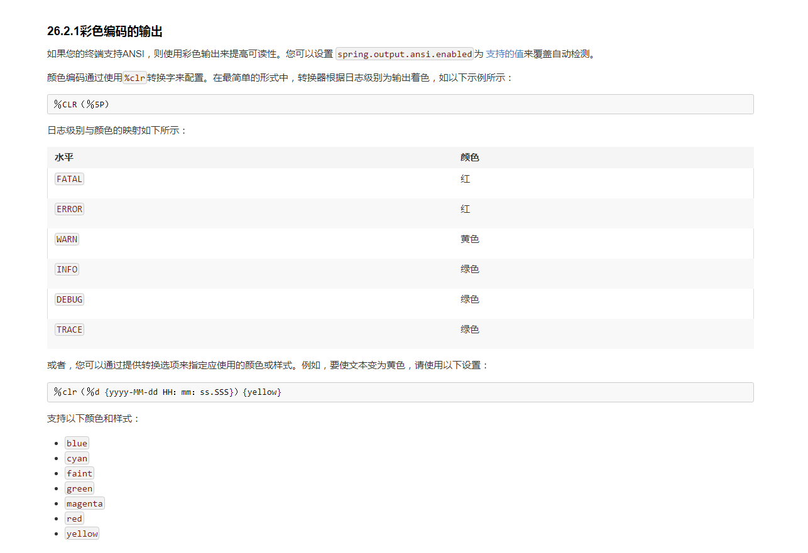

#### Spring Boot 文档阅读
* @EnableAutoConfiguration 代码可以自动地完成一些注入,例如依赖了spring-boot-starter-web,导入tomcat和mvc后,将自动配置
spring相关的配置.(例如之前的视图解析器等). 该注解被包含在@SpringBootApplication注解中,并且一个通常只需在主类声明一次即可.

* 可以通过属性配置,取消spring boot的自动配置类(也可以使用上的@EnableAutoConfiguration注解中的exclude和excludeName)
> spring.autoconfigure.exclude

* 在一个类中将其他bean注入属性,推荐如下方法(并将属性声明为final,如果注入的方法是一个构造方法,还可以省略@Autowired)
>
    	private final RiskAssessor riskAssessor;
    	@Autowired
    	public DatabaseAccountService(RiskAssessor riskAssessor) {
    		this.riskAssessor = riskAssessor;
    	}
>

* 前端编辑.如果热加载开发时,对前端页面的修改响应不及时,可以使用spring-boot-devtools依赖内嵌的LiveReload服务器,并在chrome中配置插件使用.

* 横幅彩蛋,直接在resources中加入banner.txt文件,或通过banner.location属性修改默认位置.该配置修改启动应用时的那个spring标志图  
或添加图片banner.gif，banner.jpg或banner.png,也可用banner.image.location属性修改默认位置.  
该txt中.可设置一些变量.例如应用版本号等..也可禁用.也可在代码中输出横幅等..

* @PropertySource无法加载yml文件.

* 可以对属性文件导入的配置进行校验,如下,并且,可以实现一个自定义的校验规则类.
>
    @ConfigurationProperties(prefix="connection")
    @Validated
    public class FooProperties {
    	@NotNull
    	private InetAddress remoteAddress;
    	@Valid
    	private final Security security = new Security();
    	// ... getters and setters
    	public static class Security {
    		@NotEmpty
    		public String username;
    		// ... getters and setters
    	}
    }
>

* 调试模式,在属性文件中添加debug=true,或者jar运行时使用 --debug参数. 还有跟踪模式,使用--trace.

* 彩色日志

* 日志级别,如下,指定指定包的日志级别
>
    logging.level.root = WARN
    logging.level.org.springframework.web = DEBUG
    logging.level.org.hibernate = ERROR
>

* logback日志扩展,支持在指定profile(属性文件中激活)启用指定日志配置.以及支持环境变量

* 可自定义spring mvc的消息转换器HttpMessageConverters/json序列化器等

* 生成错误代码

* 自定义的网站图标favicon.ico

* 异常处理,可自定义ErrorController,并继承BasicErrorController,默认是返回text/html,可扩展BasicErrorController,
使用@RequestMapping的produces属性,来支持json等

* 异常处理,如下,在指定位置添加对应状态码html,自动返回到对应页面,也可自行用代码更改,也可以使用spring mvc常规的@ExceptionHandler处理异常

* 异常处理,对于非springmvc的页面,也有对应的异常处理方法.

* CORS,跨域,使用@CrossOrigin注解指定controller方法,也可如下自由配置指定ur  
还有使用注解配置management.endpoints.web.cors.allowed-origins等

* 关于WebFlux,容后再议.

* CentOS + Tomcat时,注意点

* 过滤器/拦截器/监听器配置,或者使用@WebServlet，@WebFilter和@WebListener注解

* 自定义RestTemplate.使用RestTemplateCustomizer.例如配置其使用代理等

* JMX,监控相关.

* Junit,测试mvc相关.

* 条件注释,根据注解,判断是否注入bean,注意顺序可能会导致bug(可用@Order指定)
>
    @ConditionalOnClass: 类存在
    @ConditionalOnMissingClass:类不存在
    @ConditionalOnBean: bean存在
    @ConditionalOnMissingBean: bean不存在
    @ConditionalOnProperty: 根据属性判断
    @ConditionalOnResource: 根据资源(文件)判断,可以是服务器某个目录的文件等
    @ConditionalOnExpression: 使用el表达式
>   

* 可自定义FailureAnalyzer,用于在启动时,处理启动异常

* 有方法,在属性文件中,获取到pom.xml中配置的maven参数

* 使用随机的端口:server.port=0

* 支持开启多个tomcat连接器,例如一个http和一个https

* 如果有某些很老版本的cookie导致bug,可使用LegacyCookieProcessor